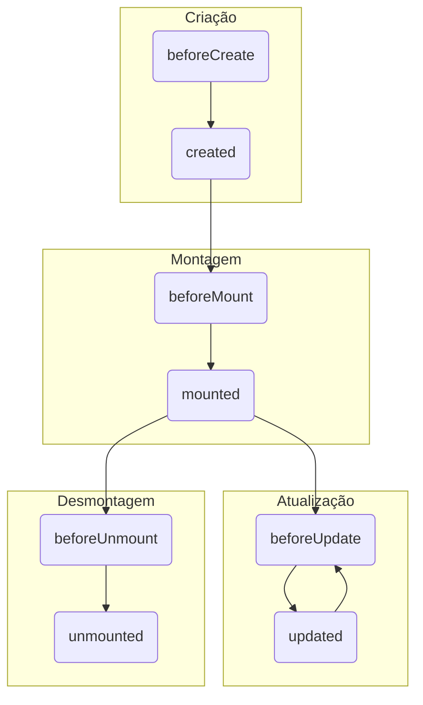

# 🛰️ VueJS com API REST e Ciclo de Vida

Até agora, trabalhamos com dados "mockados" (fixos no código) dentro do nosso `data`. Chegou a hora de dar o próximo passo e conectar nossa aplicação Vue a um backend real, usando a `fetch` API que já aprendemos.

**Objetivos da aula:**

* Buscar dados de uma API quando o componente é iniciado (`GET`).
* Enviar novos dados para a API (`POST`).
* Mostrar um feedback de "carregando" (loading) para o usuário.
* Tratar e exibir erros que possam ocorrer na comunicação.

-----


Claro\! Ótima ideia. Aprofundar no ciclo de vida é fundamental para entender *quando* e *onde* executar ações importantes, como as chamadas de API.

Aqui está a aula sobre "VueJS com API REST" reestruturada para incluir uma explicação mais detalhada sobre o ciclo de vida do Vue, junto com um diagrama Mermaid para ilustrar o processo.

-----

# 🛰️ VueJS com API REST

Até agora, trabalhamos com dados "mockados" (fixos no código). Chegou a hora de conectar nossa aplicação Vue a um backend real, usando a `fetch` API. Para fazer isso da forma correta, primeiro precisamos entender como uma aplicação Vue "nasce, vive e morre". Esse processo é chamado de **Ciclo de Vida do Componente**.

**Objetivos da aula:**

* Entender o ciclo de vida de um componente Vue.
* Aprender a usar os *hooks* de ciclo de vida, principalmente o `mounted`.
* Buscar dados de uma API quando o componente é iniciado (`GET`).
* Enviar novos dados para a API (`POST`).
* Mostrar um feedback de "carregando" (loading) para o usuário.
* Tratar e exibir erros que possam ocorrer na comunicação.

-----

## 🔁 O Ciclo de Vida do Vue (Component Lifecycle)

Toda instância ou componente Vue passa por uma série de etapas desde o momento em que é criado até ser destruído. O Vue nos oferece "ganchos" (hooks), que são funções que podemos usar para executar nosso código em momentos específicos desse ciclo.

Imagine um personagem em um jogo:

1.  **Criação:** O personagem é carregado na memória.
2.  **Montagem:** Ele aparece na tela do jogo.
3.  **Atualização:** Suas estatísticas (vida, energia) mudam em resposta a ações.
4.  **Desmontagem:** Ele é removido da tela do jogo.

Os hooks nos permitem programar ações para cada uma dessas fases.

### Diagrama do Ciclo de Vida

Aqui está um diagrama simplificado dos hooks mais importantes que vamos usar:



### Principais Hooks e Quando Usá-los

* **`beforeCreate()`**: Acontece antes de tudo. A instância foi inicializada, mas os dados reativos e os eventos ainda não foram processados. Você **não tem acesso** a `this.data` aqui.
* **`created()`**: A instância foi criada. Você **já tem acesso** aos dados (`this.data`) e métodos (`this.methods`), mas o template HTML ainda não foi processado nem inserido na página. É um bom lugar para chamadas de API que não dependem do DOM.
* **`beforeMount()`**: Ocorre logo antes de o componente ser inserido no DOM. O template foi compilado, mas ainda não está na página.
* **`mounted()`**: **O hook mais importante para nós\!** Ele é executado assim que o componente é inserido com sucesso no DOM. A partir daqui, a página está visível para o usuário, e podemos manipular o DOM com segurança (embora prefiramos deixar o Vue fazer isso). **É o local ideal para fazer chamadas de API que precisam preencher a tela com dados.**
* **`beforeUpdate()` / `updated()`**: São chamados antes e depois de o DOM ser atualizado por causa de uma mudança nos dados reativos. Útil para depuração ou para interagir com bibliotecas externas após uma atualização.
* **`beforeUnmount()` / `unmounted()`**: Chamados antes e depois de um componente ser removido do DOM. Útil para "limpar a casa", como remover `event listeners` manuais.

-----

## 📞 Integrando o `fetch` usando `mounted`

Com o ciclo de vida em mente, fica claro por que `mounted()` é a nossa escolha: queremos buscar os dados da API assim que a nossa aplicação estiver pronta e visível na tela.

```javascript
createApp({
  data() {
    return {
      livros: [],
      isLoading: false, // Para estado de carregamento
      erro: null        // Para tratar erros
    }
  },
  mounted() {
    // Este código roda automaticamente quando a app carregar.
    console.log('A aplicação foi montada! Hora de buscar os dados.');
    this.carregarLivros(); // Chamando nosso método
  },
  methods: {
    async carregarLivros() {
      this.isLoading = true;
      this.erro = null;

      try {
        const response = await fetch('http://localhost:3000/livros');
        if (!response.ok) {
          throw new Error('Não foi possível carregar os livros.');
        }
        const dados = await response.json();
        
        // A mágica da reatividade acontece aqui!
        this.livros = dados;

      } catch (e) {
        this.erro = e.message; // Capturamos o erro para exibir na tela
      } finally {
        this.isLoading = false; // Garante que o loading sempre termine
      }
    }
  }
}).mount('#app');
```

-----

## 📞 Integrando o `fetch` para buscar dados (`GET`)

Vamos pegar a lógica do `fetch` que já conhecemos e colocá-la dentro de um método.

A grande vantagem do Vue é: assim que atualizarmos `this.livros` com os dados da API, a tela será **reativamente** atualizada.

```javascript
methods: {
  async carregarLivros() {
    // Usaremos a mesma sintaxe async/await
    const response = await fetch('http://localhost:3000/livros');
    const dados = await response.json();

    // A mágica acontece aqui!
    // Ao atualizar 'livros', o v-for na tela é re-renderizado.
    this.livros = dados;
  }
}
```

-----

## ⏳ Tratando Estado de Carregamento (Loading)

Uma boa experiência de usuário exige que o sistema dê feedback enquanto uma operação demorada (como uma chamada de API) acontece.

**Passo 1: Adicionar uma variável de estado no `data`**

```javascript
data() {
  return {
    livros: [],
    isLoading: false // Começa como falso
  }
}
```

**Passo 2: Usar `v-if` no HTML**

```html
<div id="app">
  <div v-if="isLoading">
    <p>Carregando...</p>
  </div>

  <ul v-else>
    <li v-for="livro in livros" :key="livro.id">
      {{ livro.titulo }}
    </li>
  </ul>
</div>
```

**Passo 3: Atualizar o estado no método `fetch`**

```javascript
methods: {
  async carregarLivros() {
    this.isLoading = true; // Inicia o loading

    // Bloco finally é executado sempre, com sucesso ou erro.
    // Ótimo para garantir que o loading termine.
    try {
      const response = await fetch('http://localhost:3000/livros');
      const dados = await response.json();
      this.livros = dados;
    } catch (e) {
      // Trataremos os erros no próximo tópico
      console.error(e);
    } finally {
      this.isLoading = false; // Finaliza o loading
    }
  }
}
```

-----

## showError: Tratando Erros de Comunicação

E se a API estiver fora do ar? Precisamos informar o usuário.

**Passo 1: Adicionar uma variável de erro no `data`**

```javascript
data() {
  return {
    // ...
    erro: null // Começa como nulo
  }
}
```

**Passo 2: Usar `v-if` no HTML para mostrar o erro**

```html
<div id="app">
  <div v-if="erro" class="alerta-erro">
    <p>{{ erro }}</p>
  </div>
  </div>
```

**Passo 3: Capturar o erro no bloco `catch`**

```javascript
methods: {
  async carregarLivros() {
    this.isLoading = true;
    this.erro = null; // Reseta o erro a cada nova tentativa

    try {
      const response = await fetch('http://localhost:3000/livros');
      if (!response.ok) {
        throw new Error('Não foi possível carregar os livros.');
      }
      this.livros = await response.json();
    } catch (e) {
      // Define a mensagem de erro para ser exibida na tela
      this.erro = e.message;
    } finally {
      this.isLoading = false;
    }
  }
}
```

-----

## 📤 Enviando Dados com `POST`

Para adicionar um novo livro, o processo é similar. O método `adicionarLivro` agora fará uma requisição `POST` e, em caso de sucesso, chamará `carregarLivros()` para atualizar a lista com os dados mais recentes do servidor.

```javascript
methods: {
  // ... carregarLivros ...

  async adicionarLivro() {
    const novoLivro = {
      titulo: this.novoTitulo,
      autor: this.novoAutor
    };

    try {
      const response = await fetch('http://localhost:3000/livros', {
        method: 'POST',
        headers: { 'Content-Type': 'application/json' },
        body: JSON.stringify(novoLivro)
      });

      if (!response.ok) {
        throw new Error('Erro ao adicionar livro.');
      }

      // Limpa os campos e recarrega a lista do servidor
      this.novoTitulo = '';
      this.novoAutor = '';
      this.carregarLivros(); // Garante que a lista está 100% em sincronia

    } catch (e) {
      this.erro = e.message;
    }
  }
}
```

### ✅ Próximos Passos

Agora você sabe o essencial para criar uma aplicação Vue dinâmica e conectada a um backend. O próximo desafio é aplicar esses mesmos conceitos para as funcionalidades de **DELETE** e **PUT/PATCH**.